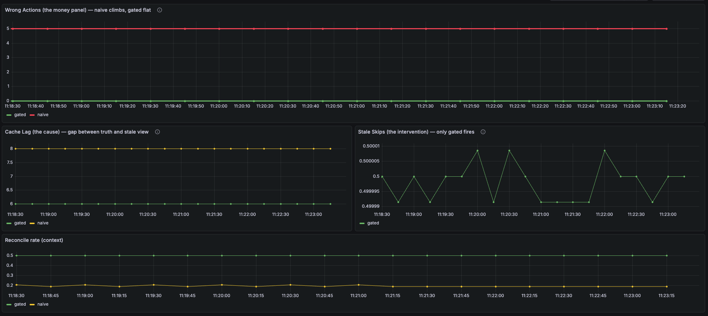
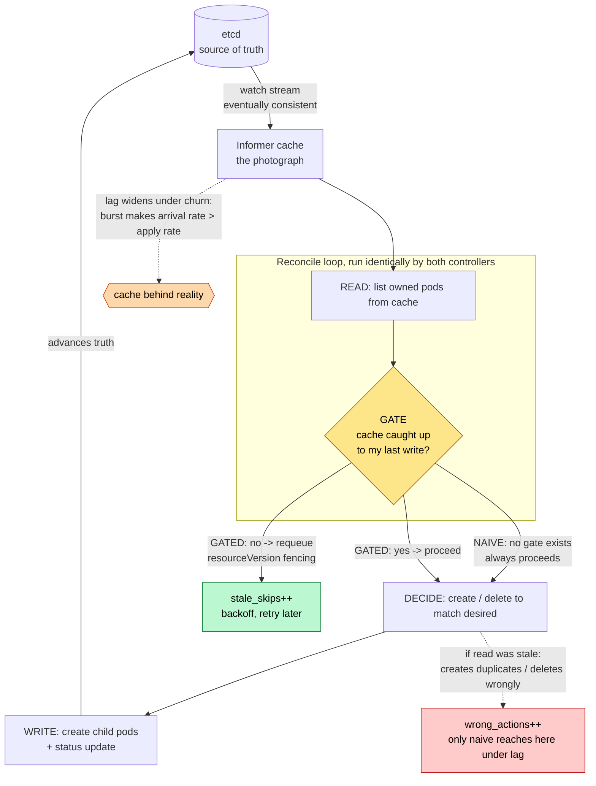

# Staleness Demo — Controller Discipline for High-Churn Workloads

A minimal, reproducible harness that isolates one production failure mode:
**a controller acting on a stale informer cache and therefore taking a wrong
action** — and the ~10-line discipline (`resourceVersion` fencing) that prevents
it. Companion artifact for the talk *"When Reconcile Falls Behind."*

**No GPUs. Runs on a laptop.** kind for a real control plane, kwok for cheap
fake nodes, two controllers identical except for one gate.

---

## Why this matters (and why it's not edge-case engineering)

A controller never reads etcd. It reads a local informer cache kept current by a
watch stream that is *eventually consistent*. There is always a window between
"etcd knows X" and "my cache knows X." Under calm load that window is
milliseconds — harmless. Under churn it widens to seconds — wide enough to cross
a decision boundary and cause a wrong action.

This is a **threshold effect, not a constant fire.** Historically, most
controllers ran below the threshold most of the time, which is exactly *why* the
assumption "my cache is fresh" became universal and unexamined. It was a tail
risk you could mostly ignore.

It is no longer ignorable, for two documented reasons:

- **Core Kubernetes changed itself over it.** KEP-5647 (v1.36, SIG API
  Machinery, alpha) adds primitives so controllers can detect when their cache
  is behind, and wires them into the four most-contended controllers (DaemonSet,
  StatefulSet, ReplicaSet, Job). Core does not feature-gate machinery into
  kube-controller-manager for hypothetical races.
- **It's a filed production failure.** KCM issue #130767 documents stale-cache
  reads causing controllers to make incorrect decisions (unnecessary resource
  creation) at scale; ecosystem operators have deleted real pods/PVCs from stale
  reads.

The frequency of the failure scales with churn rate and API-server pressure —
precisely the things high-churn (AI) workloads increase. Gang-scheduled failures
(one event → 128 correlated pod changes) and preemption storms (Google's 130K
GKE benchmark recorded 39,000 pods preempted in 93s, ~745 pods/sec) push clusters
past the threshold routinely. **The assumption that was safe to make is becoming
unsafe, and the framework for custom controllers doesn't exist yet** — KEP-5647
covers four in-tree controllers and explicitly leaves everyone else (including
JobSet, Kueue, and your operators) to handle it themselves.

That gap is what this harness teaches you to fill by hand, today.

> **Honesty note:** reproducing real cache lag on a small healthy laptop cluster
> is *hard* — precisely because the informer machinery is engineered to avoid it.
> That difficulty is evidence of *where the threshold is*, not evidence the
> threshold is rarely crossed in production. The default demo therefore
> **simulates** the lag deterministically (clean, reproducible). The
> `hack/watch-proxy/` stretch goal **induces real lag** by delaying the watch
> path the way API-server pressure does.

---

## The whole idea in one diff

Naive and gated controllers are byte-for-byte identical except for one block in
`Reconcile()`:

```go
// GATE — resourceVersion fencing. The entire difference.
if r.Lag.IsStale(fw.Name, len(pods.Items)) {   // has my cache caught up to my last write?
staleSkipsTotal.WithLabelValues("gated").Inc()
return ctrl.Result{RequeueAfter: 2 * time.Second}, nil   // no -> refuse, requeue with backoff
}
// yes -> the read is trustworthy, proceed to decide
```

The gate does not make the cache fresher. It makes the controller **honest about
when the cache isn't fresh** — converting "act confidently on a stale read" into
"wait until the read is trustworthy."

## The result in one panel

Same workload, same injected lag, two controllers. The naive controller takes
wrong actions (creates duplicates it can't see); the gated controller refuses to
act on the stale read and stays correct.



> The "Wrong Actions" panel — naive (red) climbing, gated (green) flat at 0 — is the
> single most important image for this project demo.

## Architecture — where staleness bites, and the one fork that matters

Both controllers share an identical path. They diverge at exactly one gate.



- **Shared path:** both read from the same cache. Lag (orange) is identical for both — the difference is never the *cache*, it's the *response*.
- **The fork (yellow):** naive has no gate and always falls through to DECIDE. Gated checks cache-catch-up first.
- **The two endings:** under lag, naive reaches the red box (wrong action); gated diverts to the green box (skip + requeue) until the read is trustworthy.

In production with KEP-5647 the check is
`informer.LastStoreSyncResourceVersion() < lastWriteRV`. That API is alpha and
doesn't cover custom controllers, so we implement the same shape by hand.

---

## The three signals (and which are real)

| Signal | Role | Real or harness? |
|---|---|---|
| `staleness_demo_cache_lag` | **cause** — gap between truth and cached view | real-shaped (mirrors KEP-5647 `MonitorInformerStaleness`) |
| `staleness_demo_stale_skips_total` | **intervention** — gate refusals | real (mirrors KEP-5647 requeue) |
| `staleness_demo_wrong_actions_total` | **effect** — actions contradicting ground truth | **SYNTHETIC / harness-only** |

Wrong-actions is only measurable because the harness knows ground truth. In a
real cluster you can't measure it directly — which is *why* KEP-5647 measures
the cause (lag) instead. State this on stage.

---

## Run it (each step is one make target)

```bash
make tidy            # resolve deps (first time)
kind create cluster --name staleness          # see hack/kind-kwok.md for kwok + fake nodes
make crd             # install the FakeWorkload CRD
make sample          # create FakeWorkload "demo" (replicas: 5)

# two terminals — same cluster, same workload, different controllers:
make naive           # terminal A: naive controller, metrics :8080, lag-ctl :9090
make gated           # terminal B: gated controller, metrics :8081, lag-ctl :9091

# point Prometheus at :8080 and :8081, import grafana/dashboard.json

make inject          # inject simulated lag on both -> watch the panels diverge
make clear           # clear lag -> watch them converge again
make burst           # (context) real churn storm via kwok
```

### What you should see
- **Wrong Actions panel:** `naive` climbs after `make inject`; `gated` stays flat.
- **Stale Skips panel:** `gated` fires; `naive` is structurally zero.
- **Cache Lag panel:** both see the same lag — the difference is the *response*.
- `kubectl get fw demo` shows `Desired 5 / Observed <5` on naive during lag:
  the controller's stale belief, visible without Grafana.

---

## Pattern catalog

**Core (demonstrated / central to the talk):**
1. **resourceVersion fencing** — gate reconcile on cache-catch-up to last write *(the demo)*
2. **Live reads for critical/irreversible decisions** — bypass cache with `APIReader` for deletes
3. **`observedGeneration` discipline** — "reconciled *this* spec?" vs "seen it"
4. **Controller observability** — surface lag + skip signals (KEP-5647 `MonitorInformerStaleness`)

**Adjacent (assumed / one-line context — not built):**
5. **Idempotency** — the precondition that makes requeue-and-retry safe; fix first if missing
6. **Finalizers** — stale reads + finalizer state is a known nasty interaction on deletion
7. **Conditions** — report observed state so operators can see drift

---

## When to enforce this (the A+B+C test)

resourceVersion fencing is **not** a default you bolt onto every controller. It
adds requeues and latency, and most reconciles don't need it. The discipline is
knowing *when*. Fence when roughly **all three** conditions hold:

**A — Read-your-own-write dependency.** Your decision depends on observing the
effects of writes *you* recently made. A controller that creates child objects
and then counts them to decide next steps is exposed. A controller that only
reflects spec into status, or only reads objects it never mutates, largely isn't.

**B — The action is irreversible or amplifying.** Stale read → wrong action only
matters if the wrong action *hurts*:
- *Irreversible:* deletes. Delete a pod/PVC because a stale read said "extra" and
  the work/data is gone (the zookeeper-operator incident).
- *Amplifying:* creates that compound. Create duplicates because a stale read said
  "too few," and the next reconcile is even more confused (this demo: 5 → 8 → 11).

If the wrong action is harmless and self-corrects on the next fresh reconcile,
idempotent reconciliation already covers you — skip the gate.

**C — Churn pushes you past the staleness threshold.** On a calm controller the
cache is fresh in milliseconds and the lag window never overlaps a decision; the
gate is dead weight. It earns its cost only when event/write volume is high enough
that the lag window *regularly* overlaps your decision window. This is the
condition AI-shaped churn (gang failures, autoscale/preemption storms) makes
common — and why a tail risk is becoming a constant one.

**Miss any one and the gate is probably over-engineering.** The mental model:
*fence when you act on your own recent writes (A), the action bites (B), and churn
makes the lag real (C).*

This is also why KEP-5647 onboarded exactly four controllers — DaemonSet,
StatefulSet, ReplicaSet, Job. They're the pod-managing, count-and-act, high-
contention ones: precisely A+B+C. Core didn't fence everything; it fenced the
controllers that meet the test. The KEP states the principle directly: it adds
read-after-write guarantees "at critical decision points" and only "to controllers
where we have observed issues due to stale reads." Apply the same test to your own
controllers.

The code to fence is becoming cheap (and will be cheaper once a reusable framework
exists — which the KEP says it doesn't yet). The *judgment* of where to apply it
never gets automated. That judgment is A+B+C.

---

## Resilience & failure modes

**Crash during lag is self-healing for future decisions.** The gate's
last-write-RV tracking lives in memory; a crash loses it. But on restart the
informer rebuilds via a fresh LIST that already reflects the controller's
committed writes, so the rebuilt cache is fresh by construction and the gate
correctly allows progress. Correctness here lives in **idempotent reconciliation
from a fresh cache**, not in the gate — the gate is a guard that prevents
irreversible wrong actions *during* the stale window; it cannot undo an action
already committed to etcd. KEP-5647 explicitly lists consistent-cache-on-restart
as an open edge case (depends on kubernetes/kubernetes#59848), so this is an
acknowledged boundary, not a solved guarantee.

**What the gate does NOT do:** roll back wrong actions already written; protect
against spec staleness (that's `observedGeneration`'s job — a *different* fence,
see below); or make the cache itself fresher. It only refuses to *act* until the
read is trustworthy.

---

## Why `observedGeneration` isn't enough

A fair objection: "don't we already have a staleness fence?" `observedGeneration`
answers *"have I seen the latest **spec**?"* — it fences the desired-state
round-trip, and `generation` bumps only on spec edits. But the staleness this demo
is about lives in the cache of the **child objects you manage** (pods), not in the
spec. Under churn the spec sits still (`generation` stable, `observedGeneration`
satisfied — "all caught up!") while your pod cache is seconds behind, and you take
a wrong action *with the conventional fence reporting green the whole time*.
`observedGeneration` isn't wrong; it's pointed at the wrong object.
resourceVersion fencing on the objects you act on is the fence it can't be.

---

## Layout

```
api/v1alpha1/      FakeWorkload CRD type (forces the write-read-decide loop)
controllers/
  naive_controller.go   write-read-decide, NO gate (breaks)
  gated_controller.go   identical + the gate (survives)
  lag.go                LagInjector — deterministic simulated staleness knob
  metrics.go            the three signals
cmd/main.go        manager, --mode=naive|gated, /lag control endpoint
config/            CRD + sample workload
hack/
  inject-lag.sh    flip simulated lag live
  burst.sh         real-churn context shot (kwok)
  kind-kwok.md     cluster + fake-node setup
  watch-proxy/     STRETCH: induce REAL lag via watch-path latency
grafana/dashboard.json
```

---

*A reproducible isolation of a documented control-plane failure (KCM #130767,
KEP-5647) and the resourceVersion-fencing discipline that prevents it.*